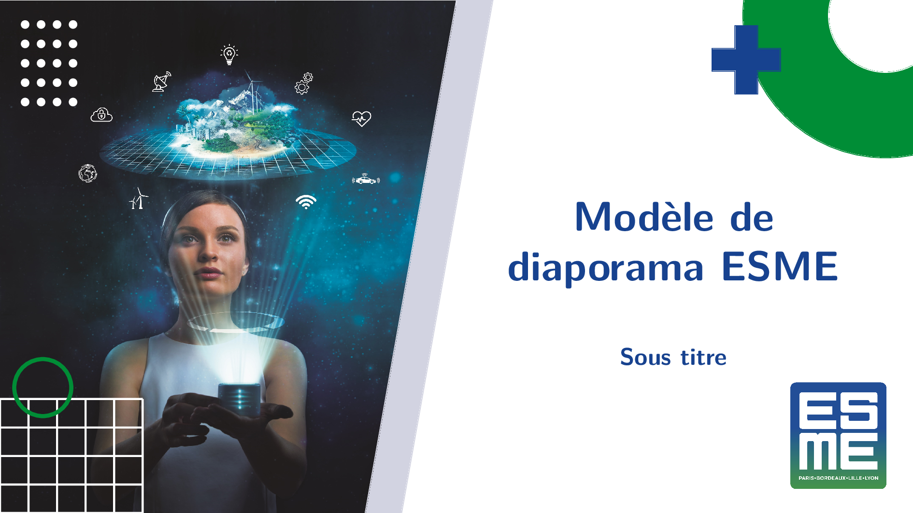
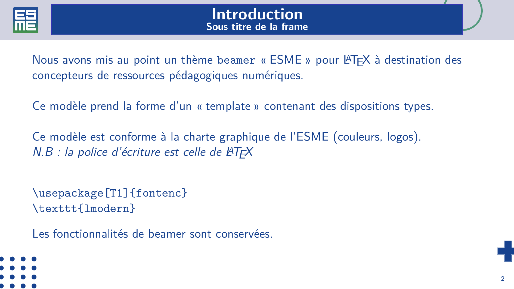
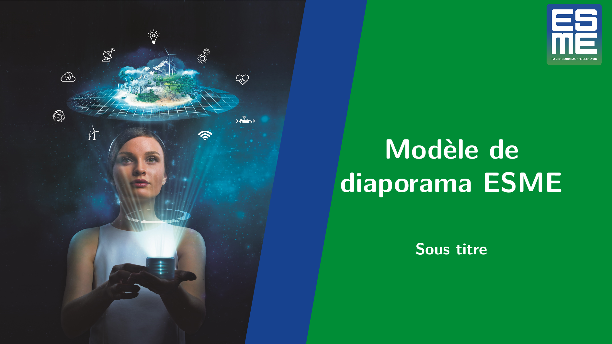
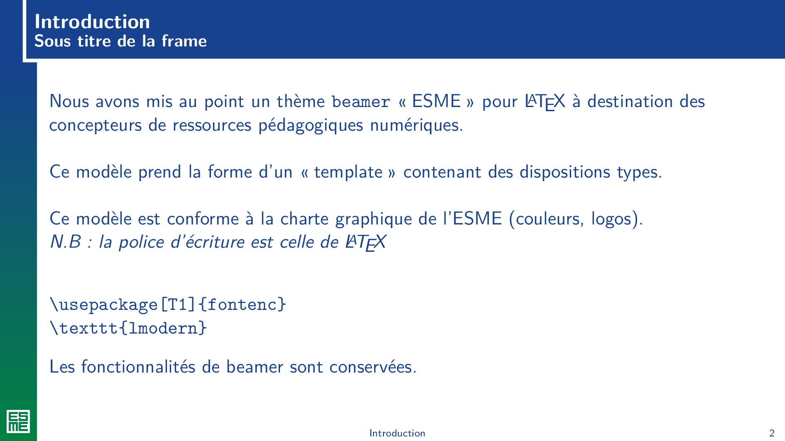
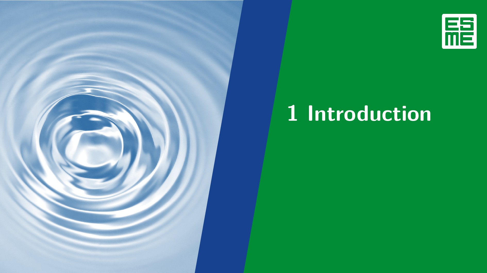

# Thèmes `esme` et `esmeDL` pour beamer

## Utilisation 

Il existe deux thèmes :  `esme` (ancien) et `esmeDL`(nouveau)/
Ces deux thèmes nécessitent l'option `aspectratio=169` de la classe beamer :

```
\documentclass[aspectratio=169,11pt]{beamer}
```

Deux possibilités :
1. copier les fichiers `*.sty` et le dossier `img/` 
   en local avec votre fichier `.tex`

ou 

2. copier le dossier `beamer` dans votre TEXMFHOME (ex.  ~/texmf/tex/latex/ )
   ou les dossier `esme` et `esmeDL` dans `beamer/themes` si ces derniers existent déjà  
### Aperçu (thème esmeDL)

#### Page de titre

#### Frame title 

#### Section page 


### Aperçu (thème esme)

#### Page de titre

#### Frame title 

#### Section page 


