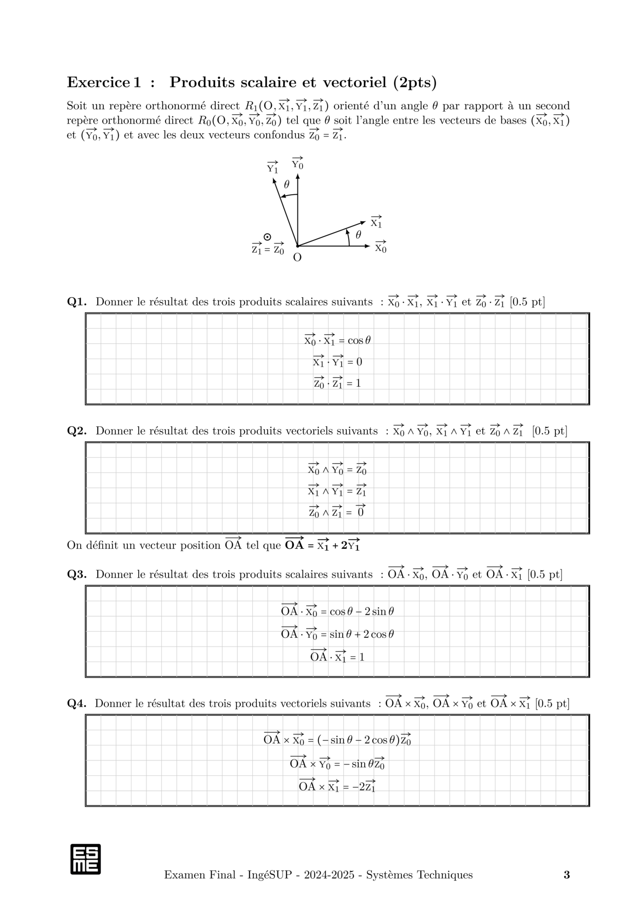

# Compiler un document $\TeX$ avec `compall`

`compall` permet de compiler un ensemble de documents différents avec un seul fichier tex.

Ce script fonctionne avec les templates `examen` et `td` de ce dépôt.

Le fichier tex source doit comporter 3 variables (`__LANG__`,`__GRILLE__` et `__CORRIGE__`) qui seront modifiées au moment de lancer le script:

1. `\usepackage[__LANG__]{babel}` pour controler la langue `[francais,english]`
2. `\grille{__GRILLE__}`  pour controler l'affiche d'une grille `[true,false]`
3. `\corrige{__CORRIGE__}` pour controler l'affichage du corrigé `[true,false]`

## Utilisation 

`compall LANG GRILLE CORRIGE <inputfile>`

## Exemples :

1. La version française de l'énoncé (sans grille) s'obtient par :

    `compall francais false false exemple.tex`

2. La version française de l'énoncé (avec grille) s'obtient par :

    `compall francais true false exemple.tex`

3. La version anglaise de l'énoncé (sans grille) s'obtient par :

    `compall english false false exemple.tex`

4. La version anglaise de l'énoncé (avec grille) s'obtient par :

    `compall english true false exemple.tex`

5. La version francaise du corrigé (sans grille) s'obtient par :

    `compall francais false true exemple.tex`

5. La version francaise du corrigé (avec grille) s'obtient par :

    `compall francais true true exemple.tex`

## Aperçu

