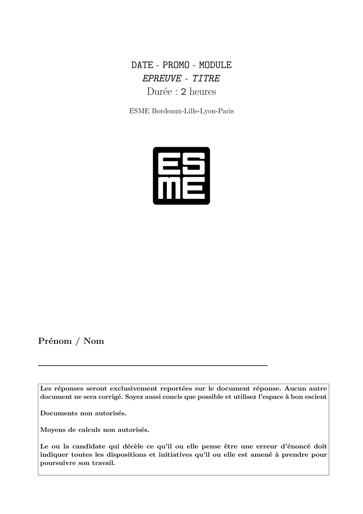
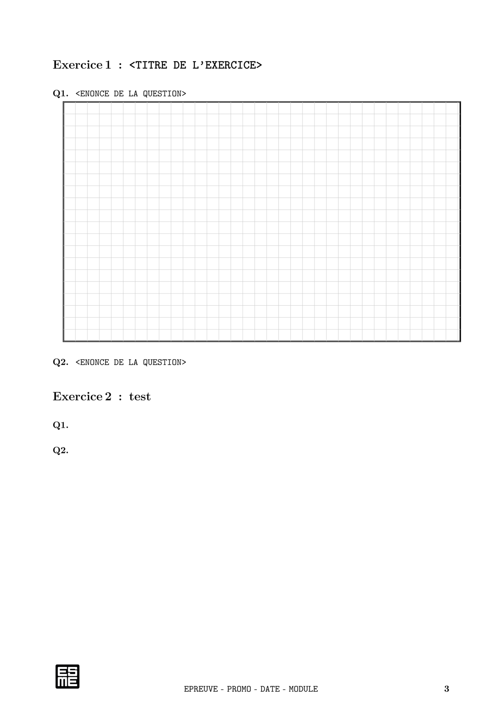

# Documentation sur le template `examen`

## Utilisation

Placer `examen.sty` en local ou dans votre installation TEXMFHOME

Pour chaque examen l'utilisateur doit configurer quelques variables 
dans le fichier `.tex` :

```
\promo{\texttt{PROMO}}     % ex. IngéSUP, IngéSPE, Ingé1
\module{\texttt{MODULE}}   % ex. Systèmes Techniques, Mathématiques Fondamentales
\annee{\texttt{DATE}}      % ex. 2022-2023
\epreuve{\texttt{EPREUVE}} % ex. MidTerm, FinalExam, Rattrapage
\titreEval{\texttt{TITRE}} % ex. Dynamique et Déformation
\dureeEval{\texttt{2}}     % ex. 2 (en nombre d'heures)
\esme{true}                % examen ESME true or false
\grille{true}              % document grille réponse true or false
\documentautorise{false}   % documents autorisés
\moyencalcul{false}        % moyen de calcul autorisés
\dispositions{false}       % dispositions en cas d'erreur rencontrée
\corrige{false}            % produire le corrigé
```

1. `promo` : Nom de la promo (ex. IngéSUP, IngéSPE, Ingé1)
2. `module` : Nom du module (ex. Systèmes Techniques, Mathématiques Fondamentales )
3. `annee` : Année scolaire (ex. 2022-2023)
4. `epreuve` : Nom de l'épreuve (ex. Midterm, Final Exam)
5. `titreEval` : Nom de l'évaluation (ex. Dynamique et Déformation, Série Entière)
6. `dureeEval` : Nombre d'heures de l'évaluation (ex. 2)
7. `esme` : Examen au logo de l'esme
8. `grille` : variable spécifiant si le document est un document réponse  
9. `documentautorise` : Les documents sont-ils autorisés ?
10. `moyendecalcul` : Les moyens de calcul sont-ils autorisés ?
11. `dispositions` : Afficher une phrase consernant la rencontre d'une erreur d'énoncé
12. `corrige` : Produire le document corrigé en utilisant les macros `\reponse{}`

Si `\corrige{true}` vous pouvez utiliser la commande `\reponse[10cm]{Le texte de la réponse}`
qui insère une grille réponse de 10cm de hauteur et permet de définir le texte de la réponse.

### Sujet en français et en anglais.

Vous pouvez utiliser la commande `\fr{<texte en français>}{<texte en anglais>}` 
pour permettre d'interpréter à la fois le texte en français et en anglais selon 
la langue utilisée en option du paquet `babel`.

Note : Vous pouvez utiliser la commande `\fr{}{}` à l'intérieur d'autres commandes. Cela peut être utile 
pour la définition des variables précédentes ou les commandes `\exercice` et `\question`. 
```
\module{\fr{Mathématiques}{Mathematics}}

\exercice{\fr{Le pendule simple}{Pendulum}}
```

### Exemples :
   Le dépôt propose des exemples :
1. Examen classes anglophones :
 `example_test.tex`  `example_test_grille.tex`
2. Examen classes francophones :
`exemple_sujet.tex`  `exemple_sujet_grille.tex`
3. Examen en deux langues dans un même fichier :
`exemple_sujet_deuxlangues.tex` `exemple_sujet_grille_deuxlangues.tex`
avec ou sans grille réponses.

### Aperçu

#### Page de titre

#### Exemple de grille de réponse 


